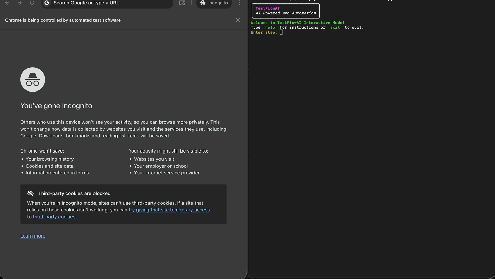

# TestFlowAI

> AI-powered test automation that **understands intent, evaluates confidence, and recovers from uncertainty**.

TestFlowAI converts human-readable test steps into Selenium actions using an AI agent — but unlike typical tools, it
**doesn’t blindly trust AI**.  
It scores decisions, retries intelligently, and re-plans when confidence is low.

## ✨ Key Features

### 🧠 Intelligent execution (not just AI generation)

- Confidence scoring for every selector
- Automatic fallback (broaden matching → AI re-plan)
- Decision transparency with detailed logs

### 🔁 Built-in reliability

- Two-layer retry system (AI + Selenium)
- Self-healing selector resolution
- Automatic cache invalidation and recovery

### 🎯 Deterministic core

- Strict JSON DSL (Pydantic validated)
- SelectorResolver (DOM-based, not guesswork)
- MemoryManager for stable reuse

### 🔍 Robust verification

- DOM-based checks (not fragile page_source scans)
- Multiple assertion types (text, visibility, count, URL)

### ⚙️ Flexible AI integration

- OpenAI + OpenAI-compatible APIs + local models
- Mock mode (no API key required)

### 🛡 Clean browser environment

- Fresh Chrome profile every run
- Optional Incognito/Private mode
- No password popups or notifications

## 🚀 Live Demo



Or try it locally with this demo test:

```bash
 python -m src.main tests/demo_test.txt
```

or use the interactive mode to enter your own steps one by one:

```bash
 python -m src.main
```

## ⚡ Quick Start

```bash
git clone https://github.com/yourname/test-flow-ai
cd test-flow-ai
pip install -r requirements.txt
cp templates/.env.template .env
# add your API key
python -m src.main demo_scenarios/happy_path.txt
```

## 🏗 Technical Overview (for deeper dive)

This section summarizes how TestFlowAI is implemented under the hood: core components, strict DSL, selector resolution +
confidence, retries, and configuration.

- High‑level architecture
    - `src/main.py`: CLI entry point. Loads .env, determines headless mode (HEADLESS), and creates the orchestrator.
    - `src/orchestrator.py`: Core control‑loop. Translates user steps via the AI agent, validates against the DSL,
      resolves targets to selectors with confidence, decides whether to accept/broaden/AI‑replan, executes via Selenium
      with retries, manages selector cache, and prints rich logs.
    - `src/ai_agent.py`: Provider‑agnostic LLM client (OpenAI, OpenAI‑compatible via base_url, and Azure OpenAI).
      Includes
      a mock translator for offline use. Enforces JSON‑only output and injects structured re‑plan context.
    - `src/selector_resolver.py`: Deterministic DOM analyzer that proposes CSS selectors and confidence scores using
      id/name/class/aria‑label/placeholder/text (+ extras in broaden mode) and small interactability bonuses.
    - `src/memory.py`: Per‑run cache mapping target → {selector, confidence}. Used for instant hits; invalidated on
      execution failure; updated after success.
    - `src/executor.py`: Selenium wrapper. Atomic actions, explicit WebDriverWait verifications, overlay dismissal, and
      ephemeral Chrome profile.
    - `src/schema.py`: Pydantic v2 models for the strict DSL; legacy → DSL adapter; fail‑fast validation.

- Strict DSL (produced by the AI, consumed by the orchestrator)
  ```json
  {
    "action": "verify",
    "target": "page",
    "assertion": {
      "type": "contains_text",
      "expected": "Welcome"
    }
  }
  ```
    - action: one of navigate, click, type, press_key, verify
    - Required fields per action:
        - navigate → url
        - click/type/verify → target
        - type → value
        - press_key → target and key (e.g., ENTER)
    - assertion.type (for verify): one of contains_text, equals_text, element_visible, element_count, url_contains
    - Backward compatibility: legacy `{selector, text}` is mapped to `{target, assertion}` transparently.
    - Pydantic v2 enforces types and required fields. Invalid commands fail fast and trigger AI retries.

- Resolution and decision logic (click/type and element‑based verifications)
    - First pass (broaden=False): resolve target → selector; compute confidence.
    - Thresholds: ≥ 0.85 accept; 0.60–0.85 → broaden once; < 0.60 → AI re‑plan.
    - Broaden pass adds more candidate attributes (title, data‑testid, alt, value, type, role) and applies a slight
      confidence damping to avoid overconfidence.
    - Logs always include: target, selector, confidence, and decision path.

- MemoryManager cache
    - Read‑through: if a target was resolved earlier, reuse the selector instantly.
    - On execution failure, cache entry is invalidated and a fresh resolution is attempted once before the next retry.
    - On success, the resolved selector and confidence are written back.

- Structured verifications (WebDriverWait, no blind page_source scans)
    - Page‑level: contains_text, equals_text, url_contains
    - Element‑level: element_visible, element_count, element text contains/equals
    - Rich AssertionError context on failure: includes expected, actual sample or URL, and selector when applicable.

- Orchestrator retries and safeguards
    - AI loop: up to `AI_RETRIES` total plans; re‑asks the AI with structured context when selector confidence is low.
    - Selenium loop: up to `SELENIUM_RETRIES` per plan with short exponential backoff; prints recovery messages when a
      later attempt succeeds.
    - Quoted‑literal enforcement: for text verifications, any quoted user literal is copied verbatim to
      `assertion.expected`.

- Logging guarantees (illustrative)
    - `AI Thought: { ... }` – always shows the exact command the AI proposed.
    - `Resolved target -> selector: '...' -> '...' (conf X.XX; first/broaden)` – shows how the tool understood your
      target.
    - `Decision path: first:0.72 broaden:0.88 (accepted)` – documents the reasoning.
    - `Cache hit ...` / `Invalidated cache ...` – shows cache behavior on success/failure.
    - `Recovered after AI attempt 2/2 and Selenium attempt 3/10.` – signals resilience in action.

- Configuration summary (env vars)
    - `HEADLESS=true|false` – run Chrome headless (useful for CI).
    - `INCOGNITO=true|false` – run browser in incognito/private mode.
    - `STRICT_NO_PASSWORD_UI=true|false` – aggressively suppress password/autofill UI and prompts (implies incognito).
    - `SELENIUM_RETRIES` – per‑plan Selenium attempts (default 5).
    - `AI_RETRIES` – total AI planning attempts per step (default 2).
    - `LLM_MODEL` / `AI_MODEL` – model or deployment name; default `gpt-4o` if unset.
    - `LLM_API_KEY` / `OPENAI_API_KEY` – API key depending on provider.
    - `LLM_BASE_URL` / `OPENAI_BASE_URL` – override endpoint for OpenAI‑compatible providers.
    - `AZURE_OPENAI_ENDPOINT`, `AZURE_OPENAI_API_KEY`, `AZURE_OPENAI_API_VERSION` – Azure‑specific settings (use your
      deployment name as the model).

## Installation

1. Clone the repository.
2. Install dependencies:
   ```bash
   pip install -r requirements.txt
   ```
3. Create your local environment file from the template:
   ```bash
   cp templates/.env.template .env
   ```
   Then open `.env` and fill in your API key and any options you need. The `.env` file is git-ignored to prevent
   accidental secret leaks.

   Configure your preferred AI provider in the `.env` file. Quick examples:

    - OpenAI (default):
      ```
      OPENAI_API_KEY=your_openai_key
      # optional overrides
      LLM_MODEL=gpt-5.4-mini
      ```

    - OpenAI‑compatible providers (just set a base URL and a key):
        - OpenRouter
          ```
          LLM_BASE_URL=https://openrouter.ai/api/v1
          LLM_API_KEY=your_openrouter_key
          LLM_MODEL=meta-llama/Meta-Llama-3.1-8B-Instruct
          ```
        - Groq (OpenAI-compatible endpoint)
          ```
          LLM_BASE_URL=https://api.groq.com/openai/v1
          LLM_API_KEY=your_groq_key
          LLM_MODEL=llama-3.1-8b-instant
          ```
        - DeepSeek
          ```
          LLM_BASE_URL=https://api.deepseek.com/v1
          LLM_API_KEY=your_deepseek_key
          LLM_MODEL=deepseek-chat
          ```
        - Local Ollama (no key usually required)
          ```
          LLM_BASE_URL=http://localhost:11434/v1
          LLM_API_KEY=EMPTY
          LLM_MODEL=llama3.1:8b-instruct
          ```

    - Azure OpenAI:
      ```
      AZURE_OPENAI_ENDPOINT=https://your-resource-name.openai.azure.com/
      AZURE_OPENAI_API_KEY=your_azure_key
      AZURE_OPENAI_API_VERSION=2024-02-15-preview
      # Use your Azure deployment name as the model
      LLM_MODEL=gpt-4o
      ```
4. Ensure you have Google Chrome/Chromium installed. With Selenium ≥ 4.6, Selenium Manager will automatically download
   and manage the correct ChromeDriver — no manual setup required.

### Notes on environment files and secrets

- The repository includes a template at `templates/.env.template`.
- Your local `.env` (at the project root) is ignored by Git via `.gitignore` to avoid committing secrets.
- Never commit real API keys. If you need to share sample configuration, update the template instead.

## Usage

### Interactive Mode

Run the tool without arguments (useful for creating new tests):

```bash
python -m src.main
```

### Batch Mode

Provide a text file with one step per line:

```bash
python -m src.main tests/sample_test.txt
```

### Commands in Terminal

- Type any natural language step (e.g., `navigate to https://www.google.com`)
- For exact text values, surround them with quotes in your step inputs. For example:
    - `verify "Google"`
    - `verify 'You logged into a secure area!'`
- Quoted text is treated as an exact literal and will NOT be auto-corrected by the AI (even if it has typos or extra
  words).
    - Example: `verify "You logged into a secure very area!"` will search for that exact string. If the page shows a
      different message, the step will fail rather than being "fixed" by the AI.
- `help`: Show usage instructions.
- `exit` or `quit`: Close the tool (when in the interactive mode).

### Browser visibility (headless vs visible)

- By default, TestFlowAI launches a visible Chrome window so you can observe execution.
- To run in headless mode (useful for CI/servers without a display), set the environment variable `HEADLESS=true`.
    - Examples:
        - macOS/Linux: `HEADLESS=true python -m src.main`
        - Windows (PowerShell): `$env:HEADLESS='true'; python -m src.main`
    - You can also put `HEADLESS=true` in your `.env` file.

### Browser profile and prompts

- TestFlowAI starts Chrome with a fresh temporary user data directory on every run. No cookies, cache, or saved
  passwords are reused.
- The Chrome password manager is disabled, and site notifications are blocked to prevent pop-ups and prompts from
  disrupting automation.

### Reliability and automatic retries

- Each step uses a two-layer retry strategy to improve robustness:
    - Selenium-level retries: the exact set of actions/locators proposed by the AI is attempted up to `SELENIUM_RETRIES`
      times (default 10).
    - AI-level attempts: if all Selenium attempts fail, the AI can re-plan the step, up to `AI_RETRIES` times in
      total (default 2). For example:
        - `AI_RETRIES=1` → just one AI plan (no re-plan).
        - `AI_RETRIES=3` → up to three distinct AI plans.
- Configure via environment variables (can be placed in your `.env`):
    - `SELENIUM_RETRIES` (default `5`)
    - `AI_RETRIES` (default `2`)
- Example:
  ```bash
  SELENIUM_RETRIES=10 AI_RETRIES=3 python -m src.main tests/demo_test.txt
  ```
- A small exponential backoff is applied between Selenium attempts; the page state is refreshed before each AI attempt.
